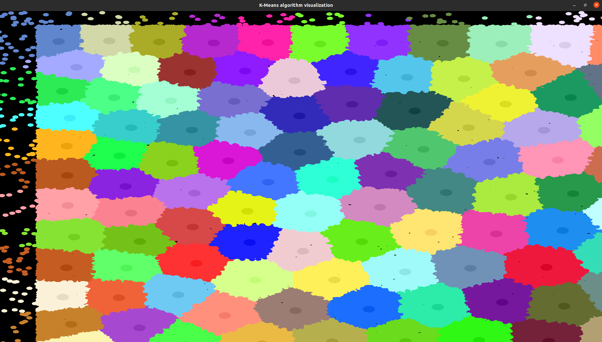

# k-means-Clustered
## leer los datos hasta la mitad
[datos]:https://data.cityofnewyork.us/Transportation/2015-Yellow-Taxi-Trip-Data/ba8s-jw6u
## [datos]:https://data.cityofnewyork.us/Transportation/2015-Yellow-Taxi-Trip-Data/ba8s-jw6u

## los datos estan fuera del rango del buffer(1000,1000) no acepta negativos

## multiplicamos por -1 en X para que esta en nuestro rango  pero en Y esta en 40,***

## Otra prueba aumentando los grupos

## Ya que os datos no varian mucho hacemos la siguiente operacion
## En X = (-1)*data+(rand()%Ancho)
## EN Y = data+(rand()%Altura)
## hacemos clustered para 100 grupos

~~~
COMPILAR: g++ kmean.cpp -lsfml-graphics -lsfml-window -lsfml-system
~~~
~~~
EJECUTAR: ./a.out
~~~
con n = 30001703

